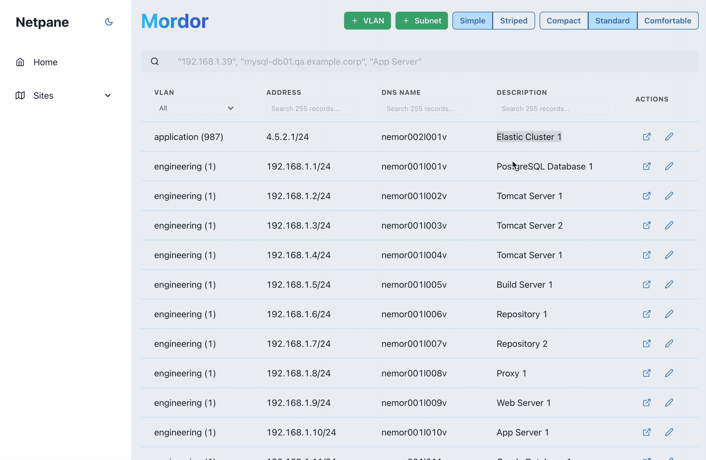

# Netpane

[](https://opensource.org/licenses/)
[](https://hub.docker.com/repository/docker/daustin/netpane)
[](https://codeclimate.com/github/famous-warplane/netpane/maintainability)

A simplistic view of Netbox IPAM. Like a box but without the depth.

## Features

### Site summary


### Cross-site search


### View and edit in Netbox



## Deployment

To deploy this project, pull the Docker image and run it with the right environment variables to connect to a Netbox instance.

### Running a container

The container runs on port 80 and requires the environment variables NETBOX_BASE_URL and NETBOX_API_TOKEN described below.

An example run command is:

```bash
  docker container run -p 8080:80 -e NETBOX_BASE_URL=http://netbox.local -e NETBOX_API_TOKEN=c51ac5bf08781ed980975db360fe1a999e3d7af4 -e LOCAL_USERNAME=admin -e LOCAL_PASSWORD=admin daustin/netpane:latest
```

## Run Locally

Clone the project

```bash
  git clone https://github.com/djaustin/netpane.git
```

Go to the project directory

```bash
  cd netpane
```

Install dependencies

```bash
  yarn
```

Start the server

```bash
  yarn dev
```

## Running Tests

To run tests, run the following command

```bash
  yarn test
```

## Environment Variables

To run this project, you will need to add the following environment variables to your `.env.local` file

`NEXT_PUBLIC_NETBOX_BASE_URL`: The base URL of the Netbox instance you wish to connect Netpane to. e.g. https://demo.netbox.app

`NETBOX_API_TOKEN`: A token providing read access to the Netbox API [see the Netbox docs for more details](https://netbox.readthedocs.io/en/stable/
rest-api/authentication/)

`NEXTAUTH_URL`: The canonical URL of your site

`LOCAL_USERNAME`: Username for local account

`LOCAL_PASSWORD`: Password for local accoount

`LDAP_URL`: The URL of the LDAP server used for authentication

`LDAP_BIND_DN`: The DN of the LDAP account used to search for valid user accounts e.g. `cn=admin,dc=example,dc=org`

`LDAP_BIND_PASSWORD`: The password for the LDAP account used to search for valid user accounts

`LDAP_USER_SEARCH_BASE`: The base DN within which to search for valid users e.g. `dc=example,dc=org`

`LDAP_USERNAME_ATTRIBUTE`: The LDAP attribute used for usernames on your chosen LDAP server e.g. `cn`

`LDAP_USER_DISPLAY_NAME_ATTRIBUTE`: The LDAP attribute used for display names on your chosen LDAP server e.g. `gecos`

## Tech Stack

**Client:** React, Chakra UI

**Server:** NextJS

## Authors

- [@djaustin](https://www.github.com/djaustin)
